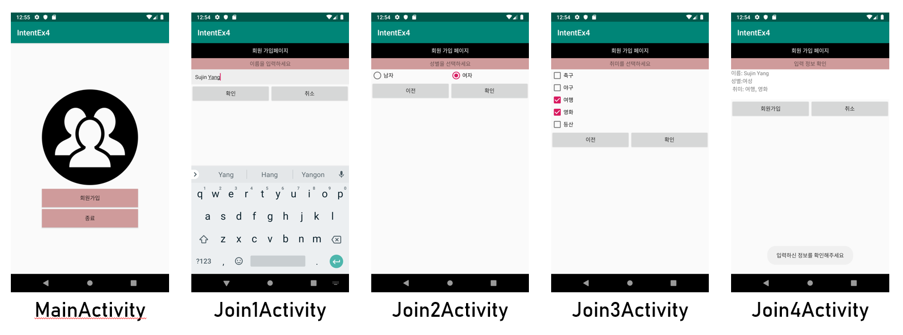

# IntentEx
ENG: Example to practice the activity switching using Intent  
KOR: Intent를 이용한 activity 전환 예제 

### 1. IntentEx1
MainActivity의 버튼을 누르면 SubActivity로 전환  
SubActivity의 버튼을 누르면 MainActivity로 전환  
  
### 2. IntentEx2 
Sub1Activity Sub2Activity Sub3Activity에서 각각의 버튼 클릭 시 그에 해당하는 Activity로 전환  
FINISH버튼 클릭 시 액티비티 종료  
  
### 3. IntentEx3
InputIntentActivity에서 입력한 문자열을 OutputIntentActivity에서 출력하기
  
### 4. IntentEx4
회원가입하기  
Join1Activity: EditText에 이름 입력  
Join2Activity: RadioGroup으로 성별 선택  
Join3Activity: CheckBox로 취미 복수 선택  
Join4Activity: 입력한 정보 확인(TextView로 출력)  
  
+ 앞으로 구현할 내용  
Join2Activity, Join3Activity에서 'btnNo'를 클릭했을 때 이전 화면으로 넘어가게 하기 (구현완료)  

